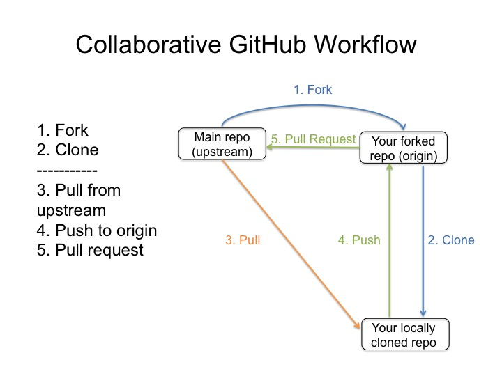
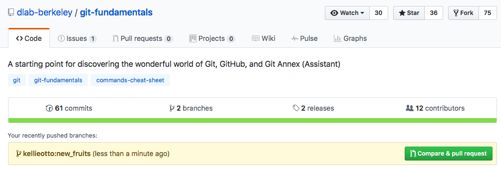

## Introduction

Basics:
-fork the repo, creating your own version. Add it as the "origin" remote and add the main repo as the "upstream" remote
- Always pull from upstream, push to origin *include wheel figure here
- Do development on a branch
- Push to origin branch, create pull request. You request the main repo to pull from you. *include diagram or screenshot here

## Branching

We've mentioned branching a few times now as the proper workflow. While you may
think making changes on your local repository and tracking the changes is sufficient,
many workflows will necissitate branching. Branching allows for multiple
versions of a repository to exist together in your local files. If you are
working on a new feature, you should first create a new branch and then work on
the feature in that branch. This allows the master branch to continue serving
as the working program, and additionally allows for other intermediate fixes to
made to the master branch, all while you're working on your own new feature.

Let's make a new branch in our fruits repository:

~~~
$ git branch new_fruits
$ git checkout new_fruits
~~~

We're going to use this branch to add new fruits, while someone else will take
care of the fruits already there. If we type `git branch` now we can see the
newly created branch. The `checkout` command changes the branch you are
currently working on. We can switch between branches by typing:

~~~
$ git checkout master
$ git checkout new_fruits
~~~

Each checkout will change the files your working on to the state of that branch.
Let's add a couple fruits to fruit_list.txt:

~~~
$ nano fruit_list.txt
~~~

Adding:

~~~
banana
kiwi
peach
orange
grape
~~~

Then we add and commit the changes *to that branch* (it will automatically add
and commit to the branch you are checked out on):

~~~
$ git add fruit_list.txt
$ git commit -m "added some new fruits"
~~~

If the feature works, and we decide we like it, we can merge it into the master
branch, after first checking out to `master`:

## Opening a pull request

Unless you own the main project repository, you won't have push access. Instead, you need to push to your own fork of the repo and open a `pull request`. It's called that because you're essentially asking the main repo to pull from your feature branch and merge those changes into its master branch.

When we push to GitHub, we need to tell git where to push it. Specifically, to which remote and what branch?

~~~
$ git push origin new_fruits
~~~

Now, we can go to the GitHub repo and we should see something like this:

Click the button and submit the pull request if it can be automatically merged. (Otherwise, you may need to do some additional work to make your new features compatible with the master branch.) The main repo owner can then decide whether or not to merge your branch.

## Merging new changes

Now the master branch has our new feature. We can delete the branch when work
on the feature is over:

~~~
$ git branch -d new_fruits
~~~

When we type `git branch` we no longer see our branch.

 
